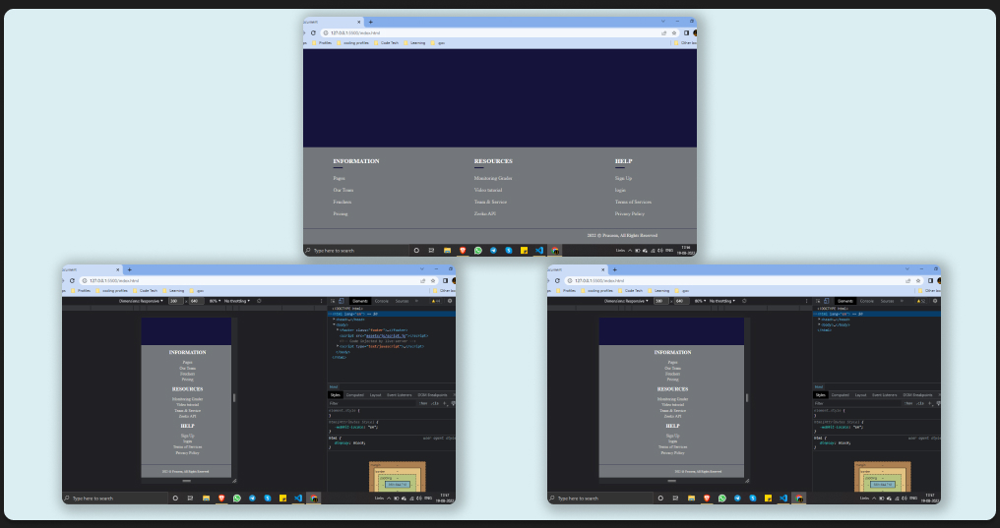

# RESPONSIVE FOOTER DESIGN.

## using Pure HTML and CSS

- Responsive footer using html and css 🛠
- Basic footer design with responsive future.
- footer with light colours
- colors used from COLOR HUNT

## Screenshots

