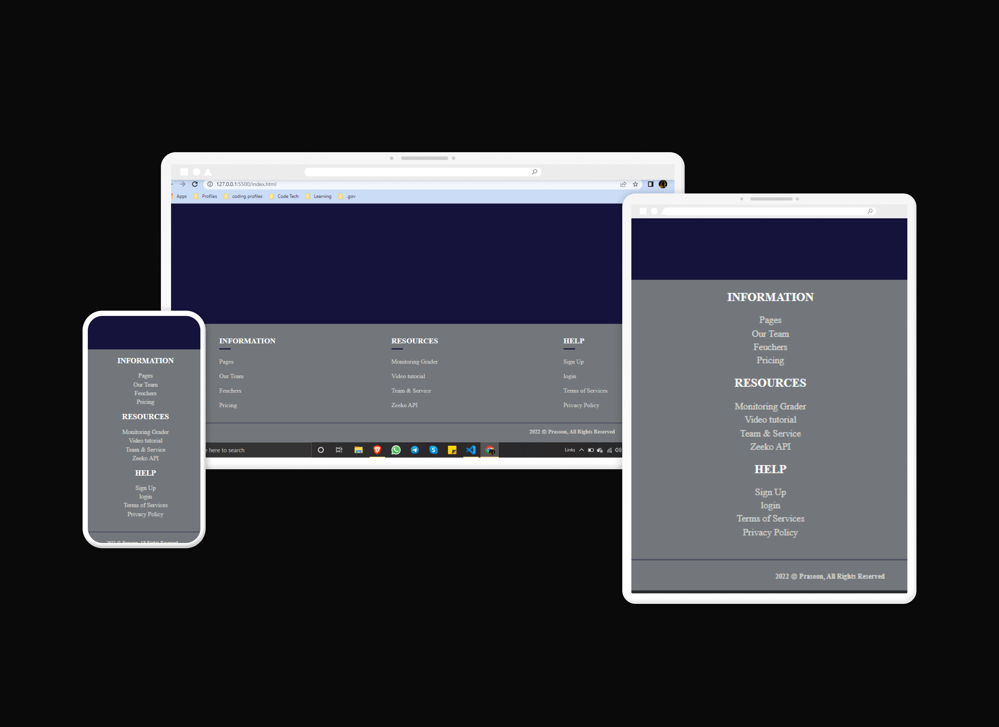

# RESPONSIVE FOOTER DESIGN.

## using Pure HTML and SASS

- Responsive footer using html and SASS 🛠
- Basic footer design with responsive future.
- footer design with light colours
- colors used from COLOR HUNT

[Live Link](https://prasoonmohan-responsive-footer.netlify.app/)

## Screenshots ...

